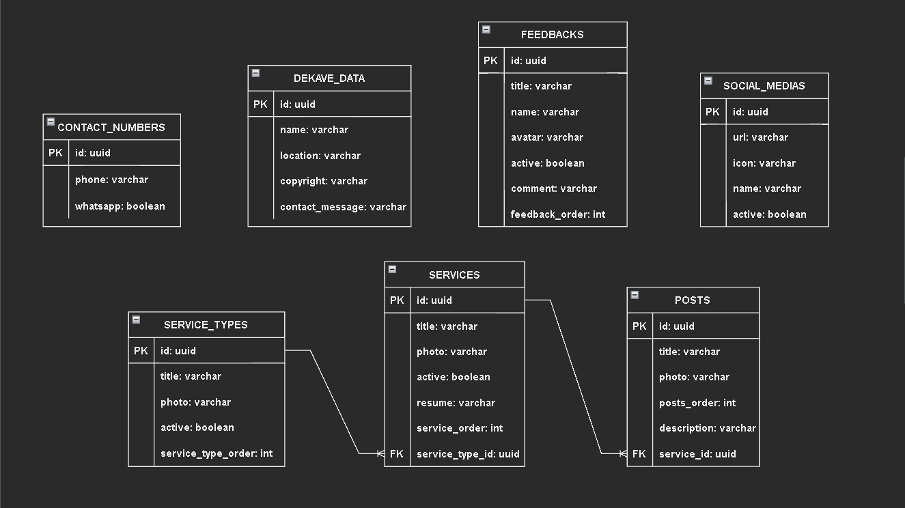

## Projeto

## Tecnologias

 - Spring Boot
 - Spring Data Jpa
 - WebService
 - Rest Api
 - PostgreSQL
 - Lombok
 - Springdoc OpenAPI

## Dependências

- IDE de sua escolha
- JDK 17.0.2
- Apache Maven 3.8.5
- PostgreSQL - Configuração padrão:
    - Host: localhost
    - Port: 5432
    - Database: postgres
    - Username: postgres
    - Password: postgres

Endereço base: http://localhost:8080/  
Swagger ui: http://localhost:8080/swagger-ui/index.html  
Api docs: http://localhost:8080/v3/api-docs

## Modelagem de dados

## 📝 License

Esse projeto está sob a licença MIT. Veja o arquivo [LICENSE](LICENSE.md) 
para mais detalhes.
